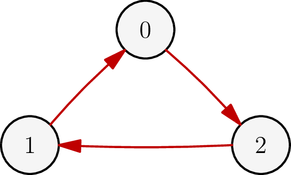
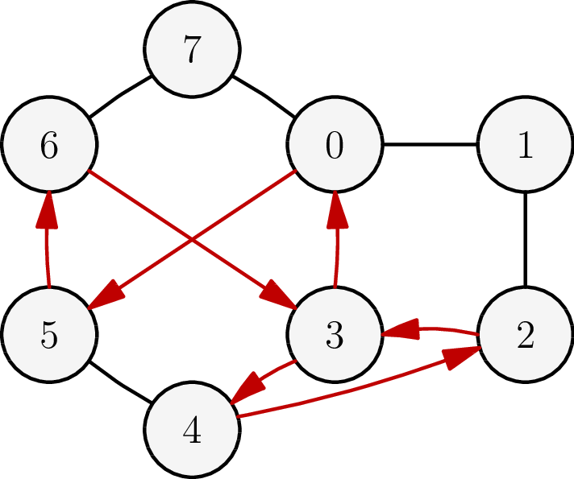

**Difficoltà: _2_**

Ape Maya è rimasta intrappolata in un nodo della tela di Tecla, un ragno molto
temuto tra le api dell’alveare. Tecla si affretta ad afferrarla ma, quando
giunge su quel nodo, si accorge di non avere appetito, e dice “BLEAH”. Va detto
che l’appetito dei ragni è molto particolare: ogni volta che percorrono un
filamento della loro rete, essi invertono lo stato del loro stomaco tra “SLURP”
e “BLEAH”. Tecla deve quindi farsi un giretto nella rete sperando di tornare da
Maya in stato “SLURP”.

La tela di Tecla è composta da $N$ nodi (numerati da $0$ a $N - 1$) connessi tra
loro da $M$ filamenti. Tecla e Ape Maya all’inizio si trovano entrambe nel nodo
$0$, e ogni filamento può essere attraversato da Tecla in entrambe le direzioni.
Aiuta Tecla ad individuare una passeggiata funzionale al buon appetito!

## Dati di input

La prima riga del file di input contiene un intero $T$, il numero di testcase.
Seguono $T$ testcase, ognuno dei quali composto da $M + 1$ righe:

- Riga $1$: gli interi $N$ ed $M$, il numero di nodi e di filamenti della tela.
- Righe $2 \ldots M + 1$: due interi separati da spazio $u$, $v$; dove $u$ e $v$
  identificano i due nodi ai capi del filamento $i$-esimo.

## Dati di output

Il file di output deve essere composto da tre righe per ciascun testcase:

- Riga $1$: la dicitura `Case #x:` dove $x$ è il numero del testcase (a partire
  da $1$).
- Riga $2$: il numero di spostamenti $L$ che Tecla deve compiere nella sua
  passeggiata.
- Riga $3$: $L + 1$ numeri separati da uno spazio, di cui il primo e l’ultimo
  devono essere $0$ (nodo di partenza e di arrivo), e gli altri sono i nodi come
  visitati da Tecla nell’ordine (e possono avere ripetizioni).

## Assunzioni

- $1 \le T \le 50$.
- $1 \le N \le 30$.
- $1 \le M \le 100$.
- In ogni filamento, $u \ne v$ e sono entrambi compresi tra $0$ e $N - 1$.
- Si garantisce l’esistenza di una soluzione: Ape Maya è spacciata!

## Esempi di input/output

***

**Input:**

```
2
3 3
0 1
1 2
2 0
8 12
0 1
1 2
2 3
3 0
2 4
3 4
4 5
5 6
6 7
7 0
0 5
6 3
```

***

**Output:**
```
Case #1:
3
0 2 1 0
Case #2:
7
0 5 6 3 4 2 3 0
```

***

## Spiegazione

Nel **primo caso di esempio**, la tela di Tecla è come nella figura seguente,
dove il percorso da seguire è evidenziato in rosso:



Nel **secondo caso di esempio**, la tela e il percorso sono:


