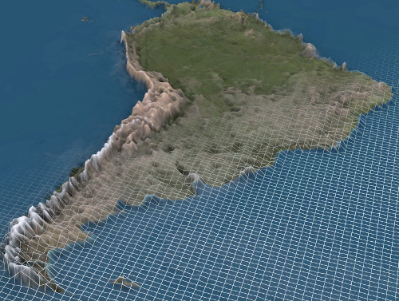

Mojito vuole pianificare un'escursione sulle colline di Volterra. Ha a
disposizione una mappa rettangolare, in cui è indicata l'altitudine della zona.
Mojito vuole fare un percorso che parte dall'angolo in alto a sinistra della
mappa e raggiunge l'angolo in basso a destra, in modo tale che il dislivello
massimo che è costretto a fare ad ogni spostamento sia il mimimo possibile.
Aiuta Mojito a calcolare questo dislivello!




## Dettagli

La mappa è una tabella di numeri interi: ciascuno esprime l'altitudine in metri
nel corrispondente punto della mappa. La tabella è composta di $H$ righe e $W$
colonne, numerate rispettivamente da $1$ a $H$ e da $1$ a $W$. Nella *cella* di
coordinate $(i,j)$, ovvero in corrispondenza della riga $i$ e della colonna $j$,
è indicato il valore dell'altitudine $A_{i,j}$.

Mojito inizia l'escursione dalla cella di coordinate $(1,1)$, in alto a
sinistra, ed arriva alla cella di coordinate $(H,W)$, in basso a destra. Ogni
minuto si sposta di esattamente una cella, in una della quattro possibili
direzioni (in alto, in basso, a destra o a sinistra). Non può però uscire dalla
mappa.

Stabilito un percorso lungo la mappa, il **pericolo** associato a quel percorso
è il *massimo dislivello tra due celle consecutive lungo il percorso*, ovvero la
differenza di altitudine fra due celle consecutive: non cambia nulla se lo
spostamento è in salita o in discesa.

Calcola il **pericolo** minimo, fra tutti i percorsi possibili che partono dalla
cella $(1,1)$ e arrivano alla cella $(H,W)$.

## Assunzioni

- $T=27$, ci sono $27$ casi di prova.
- $1 \le H, W \le 100$, la mappa ha dimensione massima $100 \times 100$.
- $(1, 1) \ne (H, W)$, ovvero la mappa è abbastanza grande da avere partenza e
  arrivo in punti diversi.
- $1 \le A_{i,j} \le 1.000.000$, l'altitudine in ogni cella è compresa fra $1$ e
  $1.000.000$.

## Dati di input

La prima riga del file di input contiene un intero $T$, il numero di casi di
test. Seguono $T$ casi di test, numerati da $1$ a $T$. Ogni caso di test è
preceduto da una riga vuota.

In ciascun caso di test, la prima riga contiene due interi $H$ e $W$ separati da
uno spazio che corrispondono all'altezza, $H$, e alla larghezza, $W$, della
mappa. Le successive $H$ righe contengono ciascuna $W$ interi separati da spazi,
corrispondenti all'altitudine in metri lungo una riga della mappa. Ovvero, in
ciascun caso di test, l'altitudine $A_{i,j}$ alle coordinate $i$ e $j$ appare
sulla riga $(i+1)$-esima, in posizione $j$.

## Dati di output

Il file di output deve contenere la risposta ai casi di test che sei riuscito a
risolvere. Per ogni caso di test che hai risolto, il file di output deve
contenere una riga con la dicitura

```
Case #t: p
```

dove `t` è il numero del caso di test (a partire da $1$) e `p` è il minimo
valore di pericolo trovato per quel test case.

## Esempi di input/output

***

**Input:** [Download](escursione_input_example.txt)
```
3

2 2
100 150
110 130

4 4
1 5 6 7
2 4 3 8
2 9 2 8
3 3 2 9

1 10
2 4 6 8 10 12 14 16 18 20
```

***

**Output:** [Download](escursione_output_example.txt)
```
Case #1: 20
Case #2: 1
Case #3: 2
```

***

## Spiegazione

Nel **primo caso d'esempio**, Mojito sceglie il percorso:

```
100   150
 ▼
110 ► 130
```

ovvero, con i seguenti spostamenti:

- *in basso*, da $(1,1)$ a $(2,1)$, con un dislivello pari a $110-100 = 10$
- *a destra*, da $(2,1)$ a $(2,2)=(H,W)$, con un dislivello pari a $130-110 = 20$.

Il pericolo del percorso è $20$ (il massimo fra i dislivelli, $10$ e $20$).

Non ci sono percorsi migliori, quindi la risposta corretta è $20$. L'altro
percorso possibile è:

```
100 ► 150
       ▼
110   130
```

che ha dislivelli $50$ e $20$, e quindi ha pericolo $50$.

Nel **secondo caso d'esempio**, Mojito sceglie il percorso:

```
1   5 ► 6 ► 7
▼   ▲       ▼
2   4 ◄ 3   8
▼       ▲   ▼
2   9   2   8
▼       ▲   ▼
3 ► 3 ► 2   9
```

Gli spostamenti hanno tutti dislivello $0$ o $1$, quindi il pericolo del
percorso è $1$. Non ci sono percorsi di pericolo pari a $0$, quindi la risposta
corretta è $1$.

Nel **terzo caso d'esempio** c'è un solo percorso possibile.
