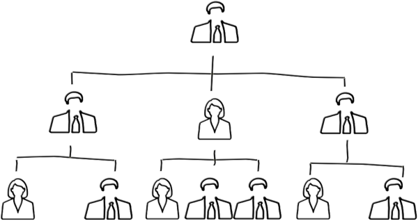
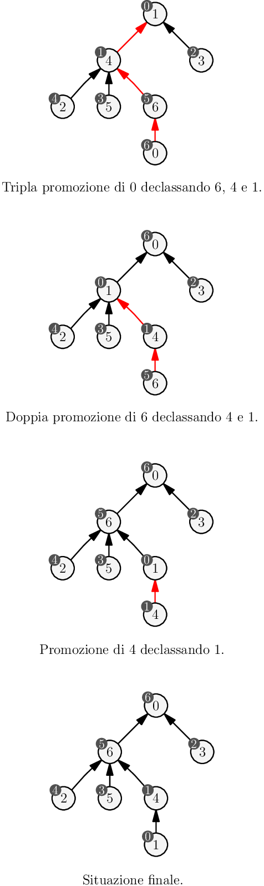
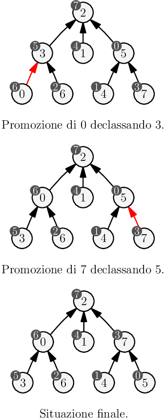

> _Per aiutarti con questo task, abbiamo preparato delle **tracce di soluzione**, che includono solo le parti di lettura dell'input e scrittura dell'output (da tastiera e su schermo). Puoi decidere se leggere/scrivere su file decommentando le opportune righe di codice._
>
> - _Scarica la traccia in C: [gerarchie.c](gerarchie.c)_
> - _Scarica la traccia in C++: [gerarchie.cpp](gerarchie.cpp)_
> - _Scarica la traccia in Pascal: [gerarchie.pas](gerarchie.pas)_

---

## Descrizione del problema

Le Olimpiadi Italiane di Informatica sono gestite da Luigi con l'aiuto di $N$
ragazzi e ragazze che prendono il nome di **tutor**. Questi membri dello staff
(che in passato hanno partecipato alle OII come voi!) con grande impegno e
dedizione mettono a beneficio delle OII le loro conoscenze tecniche. In così
tanti però è difficile organizzarsi, per questo già da molti anni è stata
definita una gerarchia molto precisa che, se rispettata, massimizza l'efficienza
della squadra.

Al tutor $i$-esimo è stato associato un **tutor di riferimento** $R_i$, che è in
pratica un altro tutor incaricato di supervisionare il suo lavoro. In cima alla
gerarchia si trova il **tutor leader**, al quale non è assegnato alcun tutor di
riferimento.



L'efficiacia di questa politica è massima quando ogni tutor di riferimento
risulta *più competente di tutti i tutor che è incaricato di supervisionare*.
Negli ultimi anni però, Luigi si è accorto che qualcosa non va: sembra infatti
che i livelli di competenza $C_i$ dei vari tutor siano cambiati e che quindi non
ci sia più il bilanciamento necessario. Urge una riorganizzazione! Però, essendo
tra amici, ed essendo la burocrazia molto costosa, sarà necessario prestare
molta attenzione alle promozioni fatte.

La promozione di un tutor $i$ consiste nello scambio di ruolo tra $i$ ed il suo
tutor di riferimento, di fatto facendo salire $i$ nella gerarchia e facendo
scendere il suo supervisore. Ognuna di queste operazioni ha un costo e, per
ribilanciare l'intera struttura, Luigi vorrebbe farne il minor numero possibile.

Essendo tra amici, Luigi vuole evitare che un tutor venga continuamente promosso
e declassato durante la riorganizzazione. Per evitare ogni problema si impone
quindi la seguente regola: se un tutor viene *promosso*, tutti i **successivi**
scambi di ruolo che lo coinvolgono dovranno essere ancora delle *promozioni*.

Aiuta Luigi a calcolare il numero di minimo di scambi che deve fare per
riorganizzare la gerarchia senza però mai violare la sua regola!

## Dati di input

La prima riga del file di input contiene un intero $T$, il numero di casi di
test. Seguono $T$ casi di test, numerati da $1$ a $T$. Ogni caso di test è
preceduto da una riga vuota.

Ciascun caso di test è composto da $N+1$ righe: la prima contiene un numero
intero $N$, il numero di tutor. Ciascuna delle seguenti $N$ righe contiene due
interi $R_i$ e $C_i$ separati da spazio: rispettivamente l'indice del tutor di
riferimento ed il livello di competenza dell'$i$-esimo tutor (con $i$ che va da
$0$ a $N-1$).

## Dati di output

Il file di output deve contenere la risposta ai casi di test che sei riuscito a
risolvere. Per ogni caso di test che hai risolto, il file di output deve
contenere una riga con la dicitura

```
Case #t: s
```

dove `t` è il numero del caso di test (a partire da $1$) e il valore `s` è il minimo numero di scambi per bilanciare la gerarchia rispettando le regole.

## Assunzioni

- $T=19$, nei file di input che scaricherai saranno presenti esattamente $19$ casi di test.
- $1 \le N \le 1000$.
- $0 \le C_i \le N-1$.
- $0 \le R_i \le N-1$ se $i$ non è il tutor leader, $R_i = -1$ se $i$ è il tutor leader.
- I valori di competenza dei tutor sono numeri da $0$ a $N-1$ e sono tutti distinti.
- Non è consentito declassare un tutor **dopo** una sua promozione ma è possibile declassarlo **prima**.
- Esiste uno ed un solo tutor leader.
- Risalendo la catena di supervisori di un qualsiasi tutor, si raggiunge sempre il tutor leader.

## Esempi di input/output

---

**Input:**

```
2

7
6 6
-1 0
4 4
1 2
1 1
4 3
4 5

8
3 6
2 4
-1 7
2 5
5 1
2 0
3 2
5 3
```

---

**Output:**

```
Case #1: 6
Case #2: 2
```

---

## Spiegazione

Nel **primo caso d'esempio** sono presenti 7 tutor, una possibile sequenza di scambi di ruolo ottima è la seguente:

- Tre promozioni del tutor 0 facendolo diventare tutor leader e declassando prima il tutor 6, poi il tutor 4 e poi il tutor 1.
- Due promozioni del tutor 5, declassando il tutor 4 e poi il tutor 1.
- Una promozione del tutor 4, declassando il tutor 1.

I tutor che hanno subito una promozione (0, 5 e 4) non hanno *successivamente* subito alcun declassamento, la situazione finale risulta bilanciata in quanto tutti i tutor hanno più competenze di coloro che sorvegliano.

Nella figura seguente, il valore nel nodo **bianco** è l'**indice** del tutor, mentre il valore nel pallino **grigio** è il valore di **competenza** di quel tutor.



---

Nel **secondo caso d'esempio** sono sufficienti i seguenti due scambi di ruolo per bilanciare l'organizzazione.


