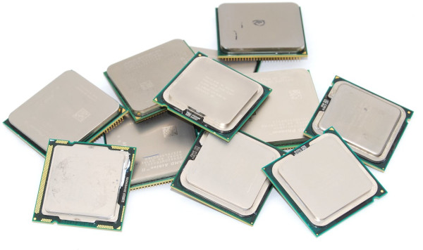

> *Per aiutarti con questo task, abbiamo preparato delle **tracce di soluzione**, che includono solo le parti di lettura dell'input e scrittura dell'output (da tastiera e su schermo). Puoi decidere se leggere/scrivere su file decommentando le opportune righe di codice.*
>
> - *Scarica la traccia in C: [multicore.c](multicore.c)*
> - *Scarica la traccia in C++: [multicore.cpp](multicore.cpp)*
> - *Scarica la traccia in Pascal: [multicore.pas](multicore.pas)*

---

## Descrizione del problema

Quest'anno Mojito, il cane di Monica, è stato incaricato di gestire il sistema
di gara delle Olimpiadi di Informatica. Essendo molto preoccupato di fare bella
figura, ha deciso di destinare tutto il budget possibile nelle CPU che verranno
usate dal sistema di gara.

Mojito vuole puntare ad avere il maggior numero possibile di *core* a
disposizione, così da gestire la gara nel migliore dei modi. Va notato infatti
che, quando tanti partecipanti sottopongono le loro soluzioni al sistema di
gara, avere tanti core disponibili è utile perché significa poter valutare
*contemporaneamente* più soluzioni.

Per esempio: con una CPU da 8 core si possono valutare 8 soluzioni
contemporaneamente. Non è detto però che una sola CPU da tanti core sia
sufficiente a gestire l'intera gara: per questo motivo, Mojito vuole acquistare
tante CPU in modo da sommare la loro capacità di calcolo (i core disponibili).
Infatti, montando una CPU da 8 core ed un'altra da 4 core, si possono valutare
contemporaneamente ben 12 soluzioni!



Sapendo di avere un budget pari a $B$ centesimi di euro, Mojito ha deciso di
fare i suoi acquisti su un mercatino dell'usato online. In questo sito ha
trovato $N$ inserzioni: l'$i$-esima inserzione fa riferimento ad una specifica
CPU con un certo prezzo $P_i$ ed un certo numero di core $C_i$.

Mojito è interessato a trovare il **massimo numero di core** che si possono
acquistare con il budget disponibile, ovvero: vuole massimizzare la somma dei
valori $C_i$ delle CPU selezionate facendo attenzione al fatto che la somma dei
rispettivi valori $P_i$ non superi $B$.

Aiuta Mojito scrivendo un programma che scelga quali CPU comprare!

## Dati di input

La prima riga del file di input contiene un intero $T$, il numero di casi di
test. Seguono $T$ casi di test, numerati da $1$ a $T$. Ogni caso di test è
preceduto da una riga vuota.

Ciascun caso di test è composto da $N+1$ righe. La prima riga contiene i due
interi $N, B$ separati da uno spazio: rispettivamente il numero di inserzioni ed
il budget a disposizione. Ciascuna delle seguenti $N$ righe contiene due interi
$C_i, P_i$ separati da uno spazio: rispettivamente il numero di core ed il
prezzo dell'$i$-esima CPU.

## Dati di output

Il file di output deve contenere la risposta ai casi di test che sei riuscito a
risolvere. Per ogni caso di test che hai risolto, il file di output deve
contenere una riga con la dicitura

```
Case #t: nc
```

dove `t` è il numero del caso di test (a partire da $1$) e il valore `nc` è il
numero di core che Mojito può acquistare.

## Assunzioni

- $T=27$, nei file di input che scaricherai saranno presenti esattamente $27$ casi di test.
- $1 \le N \le 300$.
- $1 \le C_i \le 200$.
- $1 \le P_i \le B \le 10^9$.

## Esempi di input/output

***

**Input:**
```
2

1 100
2 10

4 10000
4 5000
6 7000
8 4000
10 8000

```

***

**Output:**
```
Case #1: 2
Case #2: 12
```

***

## Spiegazione

Nel **primo caso d'esempio**, Mojito ha trovato un'unica inserzione di CPU dual core, e non può far meglio che comprare quella.

Nel **secondo caso d'esempio**, Mojito potrebbe comprare la CPU con 10 core, ma non gli rimarrebbe abbastanza budget per comprare altro (e similmente se comprasse la CPU con 6 core). In alternativa, può comprare le CPU con 4 e 8 core, per un totale di 12 core e un prezzo di $5000 + 4000 = 9000$ che è sotto il suo budget di $10\,000$.
