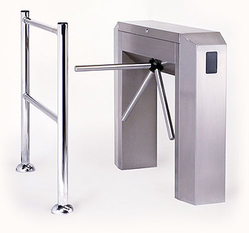

> _Per aiutarti con questo task, abbiamo preparato delle **tracce di soluzione**, che includono solo le parti di lettura dell'input e scrittura dell'output (da tastiera e su schermo). Puoi decidere se leggere/scrivere su file decommentando le opportune righe di codice._
>
> - _Scarica la traccia in C: [tornello.c](tornello.c)_
> - _Scarica la traccia in C++: [tornello.cpp](tornello.cpp)_
> - _Scarica la traccia in Pascal: [tornello.pas](tornello.pas)_

---

## Descrizione del problema

Questo settembre, all'_IIS G.B. Pentasuglia_ di Matera, si terrà la fase finale
delle Olimpiadi di Informatica. Come ogni anno Monica sarà presente e si
occuperà di aspetti organizzativi legati alla logistica degli studenti come:
assicurarsi che tutti siano presenti quando c'è da prendere un autobus,
ritrovare e restituire la valigia perduta di qualche distratto, radunare gli
studenti prima della gara in modo che nessuno rimanga per sbaglio in hotel, e
così via.

Per ottimizzare l'efficienza con la quale svolgerà queste mansioni Monica ha
pianificato di installare un **tornello**, simile a quello rappresentato in
figura, agli ingressi che le interessa controllare (come l'ingresso della sede
di gara, dell'hotel, e così via). Un tornello permette a Monica di essere
informata in modo automatizzato di quando uno studente **entra** o **esce** da
una stanza: in risposta a questi due tipi di eventi, il tornello manderà
rispettivamente un segnale `+1` e un segnale `-1` sul PC di Monica.
Naturalmente, il tornello non fornisce alcuna informazione su **chi**
effettivamente è entrato/uscito.

Al file di prevedere i movimenti degli studenti, Monica ha scelto una stanza da
monitorare e sta cercando di dedurre (a partire dalla sequenza di segnali ±1
ricevuti dal tornello posto al suo ingresso) quale sia la risposta alla seguente
domanda:

«Qual è il _**numero minimo di studenti diversi**_ che hanno visitato la
stanza?»

**Nota bene**: quando il tornello viene acceso (e comincia a "contare" gli
ingressi e le uscite) è possibile che nella stanza *siano già presenti* alcuni
studenti. Lo stesso vale quando il tornello viene spento: potrebbero *rimanere
alcuni studenti* all'interno. Inoltre, per lo scopo di questo problema,
supporremo che non ci siano ingressi/uscite secondarie per accedere alla stanza
monitorata, e che nella stanza in questione sia installato un solo tornello.



Supponiamo per esempio che nel lasso di tempo in cui il tornello è operativo
Monica riceva i segnali `-1 -1 -1`. In un caso di questo tipo, sarebbe possibile
dedurre con certezza che **almeno 3 studenti** hanno visitato la stanza:
infatti, se ne sono usciti 3, vuol dire che dentro ce n'erano almeno 3. È
possibile che nella stanza fossero presenti inizialmente più di 3 studenti, ma
con i dati a disposizione non possiamo dirlo con certezza.

Analogamente, nel caso in cui Monica ricevesse i segnali `+1 +1 +1`, si potrebbe
affermare di nuovo che almeno 3 studenti hanno visitato la stanza. Infatti, dal
momento che il tornello ha girato sempre nello stesso verso, non è pensabile che
uno stesso studente sia entrato più volte (sarebbe dovuto uscire, prima di poter
rientrare!) quindi sappiamo che il tornello è stato attivato sempre da persone
diverse.

Più complicato è invece il caso in cui Monica riceve i segnali `+1 -1 +1`. In
questo caso infatti è possibile che uno **stesso studente** sia entrato, poi
uscito e successivamente rientrato, attivando il tornello 3 volte. Quindi in
questa situazione il minimo numero di studenti diversi che hanno visitato la
stanza è 1.

Aiuta Monica scrivendo un programma che, dati i segnali ottenuti da un tornello
posizionato all'ingresso di una stanza, calcoli il **minimo numero di studenti
diversi** che hanno visitato quella stanza.

## Dati di input

La prima riga del file di input contiene un intero $T$, il numero di casi di
test. Seguono $T$ casi di test, numerati da $1$ a $T$. Ogni caso di test è
preceduto da una riga vuota.

Ciascun caso di test è composto da due righe. La prima contiene il numero intero
$N$: il numero di segnali ricevuti dal tornello. La seconda contiene $N$ interi
(ciascuno uguale a `+1` o `-1`) separati da spazio: la sequenza di segnali
ricevuti dal tornello.

## Dati di output

Il file di output deve contenere la risposta ai casi di test che sei riuscito a
risolvere. Per ogni caso di test che hai risolto, il file di output deve
contenere una riga con la dicitura

```
Case #t: c
```

dove `t` è il numero del caso di test (a partire da $1$) e il valore `c` è il
minimo numero di studenti che hanno visitato la stanza.

## Assunzioni

- $T=12$, nei file di input che scaricherai saranno presenti esattamente $12$ casi di test.
- $1 \le N \le 1\,000\,000$.

## Esempi di input/output

---

**Input:**

```
4

3
-1 -1 -1

3
+1 +1 +1

3
+1 -1 +1

10
-1 +1 +1 +1 -1 +1 +1 +1 -1 +1
```

---

**Output:**

```
Case #1: 3
Case #2: 3
Case #3: 1
Case #4: 5
```
